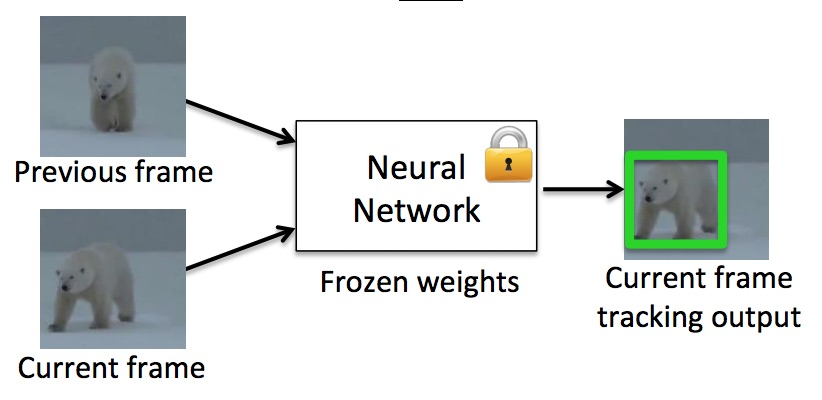

# L1 - 06: 2D Object Tracking with OpenCV and Deep Learning

## Overview

This is a set of Object Tracking projects using OpenCV and deep learning frameworks such as tensorflow, pytorch, caffe, ...

## Object Tracking Pipeline (OpenCV) 

1. BOOSTING
2. MIL 
3. KCF 
4. CRST
5. TLD: Tends to recover from occulusions
6. MEDIANFLOW: Good for predictable slow motion
7. **GOTURN**: deep learning-based
- Most Accurate 
8. MOSSE
- Fastest

